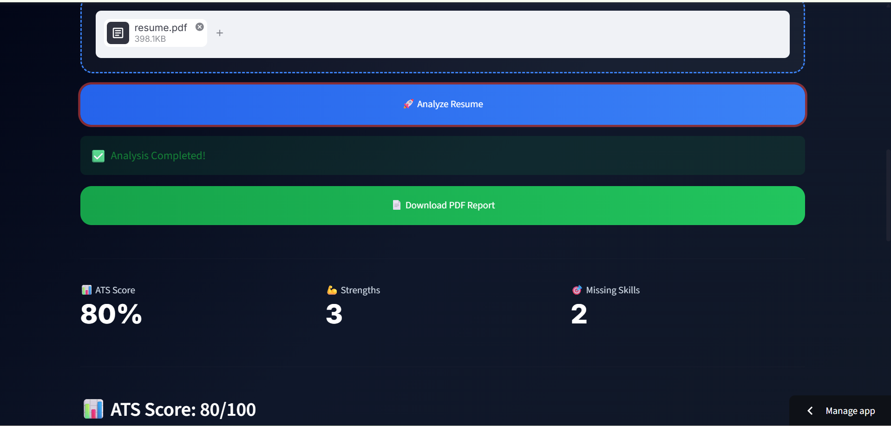
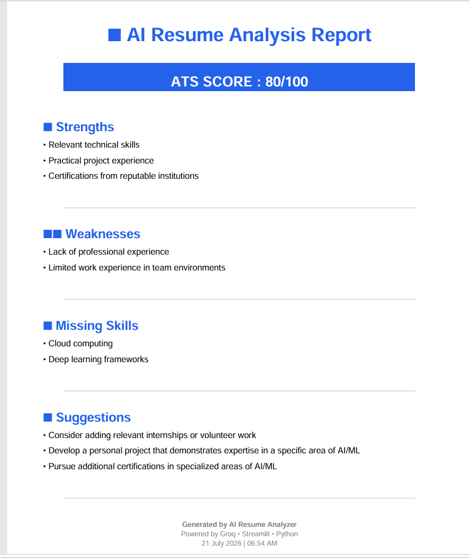

# 🤖 AI Resume Analyzer

An AI-powered Resume Analyzer built with **Python, Streamlit, and Groq (Llama 3.3 70B)** that evaluates resumes, calculates an ATS score, identifies strengths and weaknesses, highlights missing skills, provides personalized improvement suggestions, and generates a professional PDF report.

---

## 🚀 Live Demo

> **Live App:** 

---

## 📸 Screenshots
[Home](assets/home.png)






### 🏠 Home Page

_Add screenshot here_

---

### 📊 Resume Analysis

_Add screenshot here_

---

### 📄 Generated PDF Report

_Add screenshot here_

---

## ✨ Features

- 📄 Upload Resume (PDF & DOCX)
- 🤖 AI-Powered Resume Analysis using Groq (Llama 3.3 70B)
- 📊 ATS Score Calculation
- 💪 Strengths Identification
- ⚠️ Weaknesses Detection
- 🎯 Missing Skills Detection
- 💡 Personalized Improvement Suggestions
- 📥 Download Professional PDF Report
- 🎨 Modern Dark UI
- ⚡ Fast AI Responses

---

## 🛠 Tech Stack

| Technology | Purpose |
|------------|---------|
| Python | Backend |
| Streamlit | Web Application |
| Groq API | AI Resume Analysis |
| Llama 3.3 70B | Large Language Model |
| PyMuPDF | PDF Text Extraction |
| python-docx | DOCX Text Extraction |
| ReportLab | PDF Report Generation |
| HTML/CSS | UI Styling |

---

## 📂 Project Structure

```text
AI-Resume-Analyzer/
│
├── app.py
├── requirements.txt
├── README.md
├── .gitignore
│
├── services/
│   ├── groq_service.py
│   └── resume_service.py
│
├── utils/
│   ├── file_handler.py
│   ├── pdf_generator.py
│   └── logger.py
│
├── styles/
│   └── style.css
│
├── data/
│   └── reports/
│
└── assets/
    ├── home.png
    ├── analysis.png
    └── report.png
```

---

## ⚙️ Installation

### Clone Repository

```bash
git clone https://github.com/yourusername/AI-Resume-Analyzer.git
```

```bash
cd AI-Resume-Analyzer
```

### Create Virtual Environment

#### Windows

```bash
python -m venv venv
```

```bash
venv\Scripts\activate
```

#### Linux / macOS

```bash
python3 -m venv venv
```

```bash
source venv/bin/activate
```

---

### Install Dependencies

```bash
pip install -r requirements.txt
```

---

### Create Environment Variables

Create a `.env` file in the project root.

```env
GROQ_API_KEY=YOUR_GROQ_API_KEY
```

---

### Run Application

```bash
streamlit run app.py
```

---

## 📄 Sample Workflow

1. Upload Resume (PDF/DOCX)
2. AI Extracts Resume Content
3. Groq Llama 3.3 Analyzes Resume
4. ATS Score is Generated
5. Strengths & Weaknesses are Identified
6. Missing Skills are Highlighted
7. Improvement Suggestions are Generated
8. Download Professional PDF Report

---

## 🎯 Future Improvements

- Resume Keyword Matching
- Resume Preview
- Job Description Matching
- Multi-language Support
- Resume Comparison

---

## 👨‍💻 Author

**Haider Ali**

BS Information Technology Student

Interested in AI Engineering, Machine Learning, and Automation.

---

## ⭐ Support

If you found this project helpful, please consider giving it a ⭐ on GitHub.