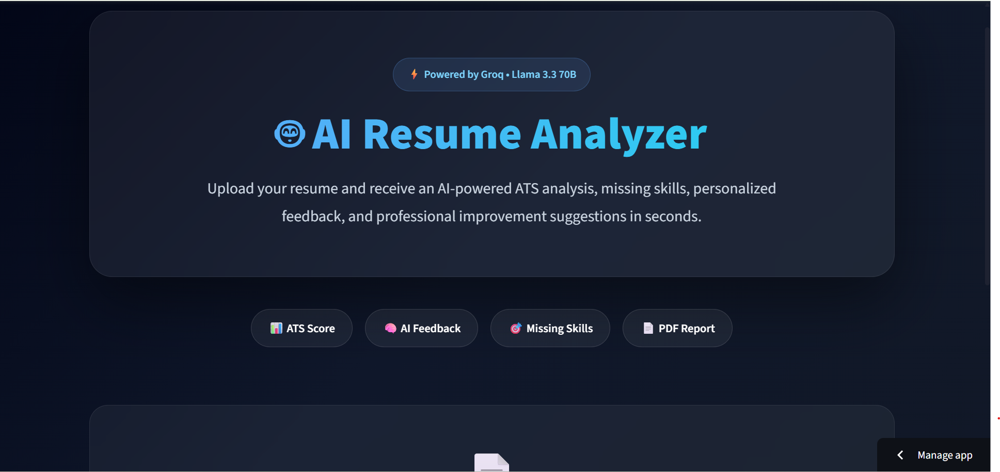

# 🤖 AI Resume Analyzer


An AI-powered Resume Analyzer built with **Python, Streamlit, and Groq (Llama 3.3 70B)** that evaluates resumes, calculates an ATS score, identifies strengths and weaknesses, highlights missing skills, provides personalized improvement suggestions, and generates a professional PDF report.

---

## 🚀 Live Demo

**Live App:** https://ai-resume-analyzer-c8behwthbj5pb2hpyaszkc.streamlit.app

---

# 🎯 Key Highlights

- 🤖 AI-powered resume analysis using **Groq Llama 3.3 70B**
- 📊 Calculates ATS compatibility score
- 🎯 Detects missing technical skills
- 💪 Identifies resume strengths and weaknesses
- 💡 Generates personalized improvement suggestions
- 📄 Creates downloadable professional PDF reports
- 🎨 Modern and responsive Streamlit interface
- 🏗️ Modular Python project architecture

---

# 📸 Screenshots

<h3 align="center">🏠 Home Page</h3>

<p align="center">
  
</p>

---

<h3 align="center">📊 Resume Analysis</h3>

<p align="center">
  
</p>

---

<h3 align="center">📄 Generated PDF Report</h3>

<p align="center">
  
</p>

---

# ✨ Features

- 📄 Upload resumes in **PDF** and **DOCX** formats
- 🤖 AI-powered resume evaluation using **Groq (Llama 3.3 70B)**
- 📊 ATS compatibility score calculation
- 💪 Resume strengths identification
- ⚠️ Weakness detection
- 🎯 Missing skills analysis
- 💡 Personalized improvement recommendations
- 📄 Professional PDF report generation
- 🎨 Clean dark-themed UI
- ⚡ Fast AI responses powered by Groq

---

# 🛠 Tech Stack

| Technology | Purpose |
|------------|---------|
| Python | Backend Development |
| Streamlit | Web Application |
| Groq API | AI Integration |
| Llama 3.3 70B | Large Language Model |
| PyMuPDF | PDF Text Extraction |
| python-docx | DOCX Text Extraction |
| ReportLab | PDF Report Generation |
| HTML/CSS | Custom Streamlit UI |
| JSON | Structured AI Responses |

---

# 📂 Project Structure

```text
AI-Resume-Analyzer/
│
├── app.py
├── config.py
├── requirements.txt
├── README.md
├── .gitignore
│
├── assets/
│   ├── home.png
│   ├── analysis.png
│   └── report.png
│
├── data/
│   ├── reports/
│   └── resumes/
│
├── logs/
│
├── services/
│   ├── groq_service.py
│   └── resume_service.py
│
├── styles/
│   └── style.css
│
└── utils/
    ├── file_handler.py
    ├── logger.py
    └── pdf_generator.py
```

---

# ⚙️ Installation

## 1️⃣ Clone the Repository

```bash
git clone https://github.com/haiderali17/AI-Resume-Analyzer.git
```

```bash
cd AI-Resume-Analyzer
```

---

## 2️⃣ Create a Virtual Environment

### Windows

```bash
python -m venv venv
```

```bash
venv\Scripts\activate
```

### Linux / macOS

```bash
python3 -m venv venv
```

```bash
source venv/bin/activate
```

---

## 3️⃣ Install Dependencies

```bash
pip install -r requirements.txt
```

---

## 4️⃣ Configure Environment Variables

Create a `.env` file in the project root.

```env
GROQ_API_KEY=YOUR_GROQ_API_KEY
```

---

## 5️⃣ Run the Application

```bash
streamlit run app.py
```

---

# 📄 Application Workflow

```text
Upload Resume
      │
      ▼
Extract Resume Text
      │
      ▼
Send Resume to Groq Llama 3.3
      │
      ▼
Generate ATS Score
      │
      ▼
Analyze Strengths & Weaknesses
      │
      ▼
Detect Missing Skills
      │
      ▼
Generate AI Suggestions
      │
      ▼
Create Professional PDF Report
```

---

# 🎯 Future Improvements

- 📄 Resume Keyword Optimization
- 💼 Job Description Matching
- 🤖 AI Cover Letter Generator
- 🎤 Interview Question Generator
- 🌍 Multi-language Support
- 📑 Resume Preview
- 📊 Resume Version Comparison

---

# 👨‍💻 Author

**Haider Ali**

BS Information Technology Student at **PUCIT**

Passionate about **AI Engineering**, **Machine Learning**, **Large Language Models (LLMs)**, and **AI Automation**.

GitHub:
**https://github.com/haiderali17**

---

# ⭐ Support

If you found this project helpful, please consider giving it a ⭐ on GitHub.
If you have suggestions or feedback, feel free to open an issue or submit a pull request.
---
